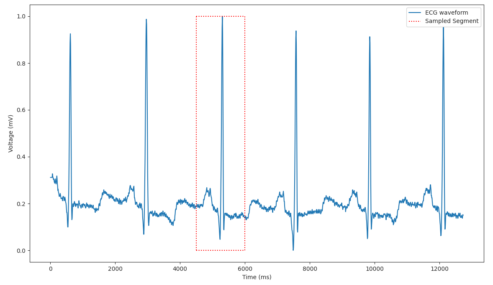
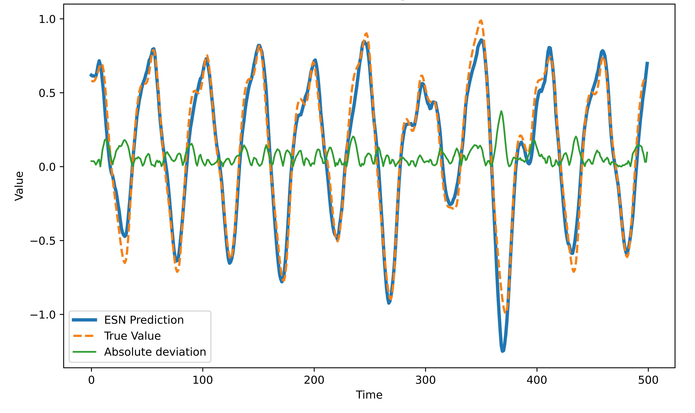

# Reservoir Computing with Genetic Oscillators

This project focuses on utilizing reservoir computing with genetic oscillators for arrhythmia classification, but also details the potential for forecasting.

We implement a reservoir of genetic oscillators as a `reservoirpy` integrated Node, within the `reservoir` module of this project.

# Environment Setup
To set up a local development environment, follow these steps:

```bash
# Create virtual environment
python -m venv venv

# Install dependencies
venv/bin/pip install -r requirements.txt
```


# Example Usage
```python
from reservoirpy.nodes import Ridge

from reservoir.reservoir import OscillatorReservoir

from utils.preprocessing import load_ecg_data
from utils.classification import classify
from utils.analysis import compute_mean_metrics
from utils.visualisation import plot_confusion_matrix, plot_tsne_clustering

# load arrhythmia inputs and targets for training and testing
X_train, Y_train, X_test, Y_test = load_ecg_data()

# initialize reservoir node
timesteps = X_train.shape[1]
reservoir = OscillatorReservoir(units=100, timesteps=timesteps)

# initialize readout node
readout = Ridge(ridge=1e-5)

# perform 5 fold cross-validation classification
folds = 5
metrics = classify(reservoir, readout, X_train, Y_train, X_test, Y_test, folds=folds)

# compute mean metrics across folds
avg_metrics = compute_mean_metrics(metrics)

# visualize metrics
plot_confusion_matrix(avg_metrics)
plot_tsne_clustering(avg_metrics)

```
> Note: more examples can be found in the [tutorials](https://github.com/James-02/dissertation/tree/main/tutorials) module.

# Modules 
- **Tutorials**: Contains juypter notebook tutorials for the processes of `classification`, `forecasting`, and `optimization` using our `OscillatorReservoir` node for reservoir computing.

- **Reservoir**: Contains the implementation of the genetic oscillator-based reservoir computer, based upon a system of delay differential equations, encapsulated within a `reservoirpy` integrated Node.

- **Utils**: Contains modules for preprocessing, classification, and visualization related to arrhythmia classification using reservoir computing.

- **Optimization**: Includes executable scripts for hyperparameter optimization using Optuna. Additionally, a SLURM script is provided as an example of how to use it with computing clusters.

# Project Overview
- **Dynamic Behavior of Genetic Oscillators**: Genetic oscillators, driven by expression processes, demonstrate dynamic behavior.

- **Utilizing Dynamic Behavior**: We leverage this dynamic behavior to convert a single input into a high-dimensional representation.

- **Modeling Genetic Oscillators**: Each genetic oscillator node is simulated using a system of delay differential equations, coordinating the behavior of two coupled genes: luxI (I) and aiiA (A). LuxI produces an AHL chemical signal (Hi), which diffuses and binds to neighboring cells' luxI repressors (He). Our external input is bound to He outside of the cell, representing influence of the external intercellular environment. We also apply a coupling strength coefficient to our input, representing cell-to-cell interaction.

- **Constructing Reservoir Network**: We build a network of genetic oscillators to form our reservoir. The edges of each oscillator node are weighted to reflect intrinsic connectivity.

- **Reservoir State Representation**: Time series data is fed through the reservoir. At each time point, the concentration of luxI gene serves as the reservoir state.

- **High-Dimensional Representation**: The final reservoir state of each time series provides a high-dimensional representation of system dynamics for each instance.

- **Classification Process**: We train a readout layer with reservoir states and corresponding labels.

- **Linear Learning Method**: The readout layer employs a linear learning method to compute the probability of each label.

# Visualization
## Genetic Oscillators

**Figure 1.** Concentrations of a single genetic oscillator's variables depicted over a sine wave spanning a time period of 1100 steps. Notably, the initial 100 timesteps, illustrated by dotted lines, signify the warmup stage, during which initial gene concentrations are induced.

## Reservoir Computing

**Figure 2.** Reservoir states over an ECG time series representing the concentration of the luxI gene, for each reservoir node, at each time point.

## Echo State Network Model

**Figure 3.** Visualization of our `OscillatorReservoir` node integrated within an echo state network architecture for  time-series classification. Notably, the `W` weight matrices define the connectivity of the layers.

## Arrhythmia

**Figure 4.** Full ECG wave visualization, with a highlighted segment representing how we derive our classification dataset from the wider MIT-BIH arrhythmia database.

## Classification

**Figure 5.** Confusion matrix of predictions for each arrhythmia label using our `OscillatorReservoir` approach to categorical classification.

## Forecasting

**Figure 6.** Visualization of a 10-timestep ahead forecasting of the mackey glass dataset using our `OscillatorReservoir`, optimized using `optimization/forecasting.py`.

## Optimization

**Figure 7.** Visualization of `OscillatorReservoir` hyperparameter importances for categorical arrhythmia classification, discovered through our `optimization/classification.py` script.

# Acknowledgements
**reservoirpy**: This reservoir computing library is instrumental for our reservoir computing implementation, our `OscillatorReservoir` class extends the reservoirpy `Node` class. 
  - [reservoirpy](https://github.com/reservoirpy/reservoirpy)

**Optuna**: Optuna is a hyperparameter optimization framework which has been significant in shaping this project.
  - [Optuna](https://github.com/optuna/optuna)

**Genetic Oscillators**: Our approach builds upon the research into coupled genetic oscillators within colonies of bacteria.
The following papers were instrumental:
  - [A sensing array of radically coupled genetic 'biopixels'](https://doi.org/10.1038/nature10722) by Prindle et al. (2011)
  - [A synchronized quorum of genetic clocks](https://doi.org/10.1038/nature08753) by Danino et al. (2010)

**Arrhythmia Dataset**:
We take our dataset from Kaggle, which was used within the following paper for arrhythmia classification.
  - [Kaggle Heartbeat Dataset](https://www.kaggle.com/datasets/shayanfazeli/heartbeat) by Shayan Fazeli
  - [ECG Heartbeat Classification: A Deep Transferable Representation](http://dx.doi.org/10.1109/ICHI.2018.00092) by Kachuee et al. (2018)
